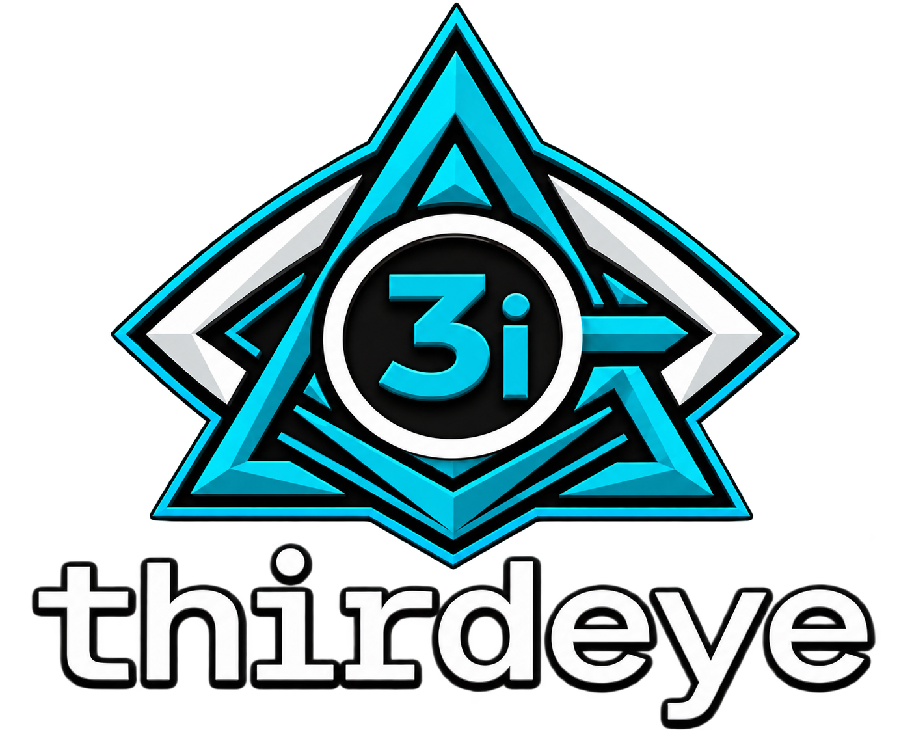

<p align="center">
  
</p>

[](https://pypi.org/project/thrdi/)
[](https://github.com/duncankmckinnon/thirdeye/actions/workflows/test.yml)
[](LICENSE)

# thirdeye

Trace agent sessions locally, then search, review, and evaluate them in one place.

For guides, reference documentation, and updates, visit [third3y3.com](https://third3y3.com).

## Installation

Homebrew is the simplest option on macOS and Linux:

```bash
brew install duncankmckinnon/tap/thirdeye
```

Or install with `pipx`, `uv`, or `pip`:

```bash
pipx install thrdi
uv tool install thrdi
pip install thrdi
```

Configure supported agents and optional Logfire export interactively:

```bash
thirdeye setup
```

Run `thirdeye --help` for the command reference.

## Logfire

Thirdeye can export captured agent sessions to [Pydantic Logfire](https://logfire.pydantic.dev)
as OpenTelemetry traces. Enable it with a saved gateway key or browser-based login:

```bash
thirdeye logfire enable
thirdeye logfire status
thirdeye logfire disable
```

See [third3y3.com](https://third3y3.com) for Logfire configuration and export details.

## Skills

Thirdeye includes agent skills for searching sessions, evaluating agent behavior,
and reviewing efficiency. Install them in the current project with:

```bash
thirdeye skills list
thirdeye skills add
```

Use `thirdeye skills add --only thirdeye-review` to install one skill, or run
`thirdeye skills add --claude --codex` for agent-specific locations.

## Contributing

Contributions are welcome. See [CONTRIBUTING.md](CONTRIBUTING.md) for local
development, validation, and pull-request guidance.
